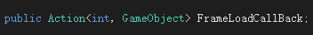

# 一个支持UI界面分块分帧加载编辑的组件

有时候UI界面做的比较复杂，首次加载和实例化的时候会有比较明显的卡顿，这个时候会考虑将界面拆分成多个Prefab，减小首屏加载的Prefab大小和复杂度，以往关于这块的处理会放到UI类的业务逻辑中去处理，将拆分的UIPrefab延迟加载，感觉不是很方便，总要在业务层去关心这个事情。于是想到可以制作一个组件，将需要延后加载的Prefab拎出来统一管理，并且尽量可以减小对UI Prefab制作过程和代码逻辑的影响。

#### UIPrefabPartial组件
参考C# partial class的命名，我把这个组件命名为PrefabPartial。
首先看下使用： 
 
一般来说将这个组件挂载到界面Prefab的根节点统一管理需要加载的Prefab，不过挂到子节点也可以实现嵌套。
可以看到组件上分了三个列表，Prefab，Parent，Frame。分别是需要加载的Prefab资源，加载后挂载的Parent节点以及延迟加载的帧数。
**注意这里的Prefab列，虽然是直接拖拽了Prefab资源，但实际组件中只存储了Prefab的资源路径，并没有直接引用，这样在打包的时候就不会产生依赖，可以将Prefab和主UI Prefab分别打在不同的bundle里，加载主UI的时候也不需要去额外加载依赖bundle，而是在延迟帧再去加载bundle并实例化。**

为了尽量不影响制作UI Prefab的制作过程，组件实现了在编辑器下预览Prefab内容的功能。

可以看到这个GameObject节点实际是个空节点，但是能在Scene视图中看到挂载在它下面的Prefab。并且预览的挂载的Prefab的RectTransform数据会和父节点保持一致，也就是说编辑过程中可以近似把父节点当作Prefab的实例化，运行过程中会将Prefab实例化并设置RectTransform数据与父节点一致。如果需要设置节点动画，也可以直接针对父节点设置。
与Prefab相关联的操作，比如修改该了挂载的Prefab，或UI Prefab本身，对应的变动也会及时同步到场景中的实例。
**存在的一个问题是，挂载之后再去修改该Prefab资源名或移动路径，会导致组件上挂载的资源丢失，因为组件中实际只是存储了Prefab的存储路径，并没有直接引用Prefab资源。**
运行时会将挂载的Prefab实例化，并设置父节点：


提供一个加载完成的回调方法，每加载完成一个Prefab就通知一下业务层。

#### 关于一些实现

代码中开一个PrefabInfo结构，存储父节点，资源路径和延迟帧数，这些数据将会被序列化保存到UI Prefab中。
```csharp
#if UNITY_EDITOR
//此处可改为项目资源加载接口
GameObject prefab = UnityEditor.AssetDatabase.LoadAssetAtPath<GameObject>(path);
if (prefab == null)
{
    Debug.LogError("Load Prefab Failed >>> Parent:" + parent + " PrefabPath:" + path);
    return null;
}
GameObject go = UnityEditor.PrefabUtility.InstantiatePrefab(prefab, parent) as GameObject;// Instantiate(prefab, parent.transform);
return go;
#endif
```
编辑器下使用PrefabUtility.InstantiatePrefab接口实例化，可以令创建的实例和Prefab资源文件保持连接，这样对Prefab的改动可以及时同步到场景实例上。
```csharp
RectTransform goTrans = go.transform as RectTransform;
goTrans.SetSiblingIndex(0);
go.name = pTrans.name;

goTrans.pivot = Vector2.one * 0.5f;
goTrans.anchorMin = Vector3.zero;
goTrans.anchorMax = Vector3.one;
goTrans.offsetMin = Vector2.zero;
goTrans.offsetMax = Vector2.zero;
goTrans.anchoredPosition = Vector2.zero;

goTrans.localPosition = Vector3.zero;
goTrans.localEulerAngles = Vector3.zero;
goTrans.localScale = Vector3.one;

go.name = m_PreviewName;
//需要调试的话开成注释的状态
go.hideFlags = HideFlags.HideAndDontSave;
//go.hideFlags = HideFlags.NotEditable | HideFlags.DontSave;
```
创建的prefab实例RectTransform设置为四边拉伸，令尺寸位置等和父节点保持一致。
将hideFlags设置为HideAndDontSave，可以使创建出来的Prefab实例在Hierarchy中不可见，并且不会被保存到Prefab资源中。本来这里我是设置为NotEditable | DontSave的，让这个实例在Hierarchy下可见，但是因为跟Prefab资源建立关联之后这个实例的颜色会被标蓝，编辑过程中和正常Prefab嵌套不好区分，所以干脆把它隐藏了。
```csharp
UnityEditor.PrefabUtility.prefabInstanceUpdated += OnPrefabChanged;

void OnPrefabChanged(GameObject obj)
{
    if (CheckIsPrefabInstance(this.gameObject))
    {
        if (GetPrefabRoot(this.gameObject) == GetPrefabRoot(obj))
        {
            ClearPreview();
            PreviewAllInEditor();
        }
    }
}
```
编辑器下监听一下prefab变更事件，当UIPrefab变动的时候刷新预览。
```csharp
EditorApplication.hierarchyWindowItemOnGUI += OnHierarchyGUI;

void OnHierarchyGUI(int instanceID, Rect selectionRect)
{
   if (Event.current != null && selectionRect.Contains(Event.current.mousePosition))
   {
       if (Event.current.button == 0 && (Event.current.type == EventType.MouseDown))
       {
           int controlID = GUIUtility.GetControlID(FocusType.Passive);
           GameObject selectedGameObject = UnityEditor.EditorUtility.InstanceIDToObject(instanceID) as GameObject;
           //选中物体筛选条件
           if (selectedGameObject.name.Equals(UIPrefabPartial.m_PreviewName))
           {
               Event.current.type = EventType.Ignore;
           }
       }
   }
}
```
如果HideFlags设置为显示，不可编辑，为了防止HideFlags下节点被拖动，可以监听一下Hierarchy节点选中事件，让预览出来的节点不可选中。

```csharp
var pathProperty = property.FindPropertyRelative("m_Path");
UnityEngine.Object oldPrefab = null;
string path = pathProperty.stringValue;
if(!string.IsNullOrEmpty(path))
{
    oldPrefab = AssetDatabase.LoadAssetAtPath<UnityEngine.Object>(path);
    if(oldPrefab == null)
    {
        pathProperty.stringValue = string.Empty;
    }
}
UnityEngine.Object prefab = EditorGUI.ObjectField(prefabRect, oldPrefab, typeof(GameObject), false);
```
最后重写Inspector编辑器，把 m_Path 资源路径的选择改成拖拽Prefab的形式，方便编辑。

